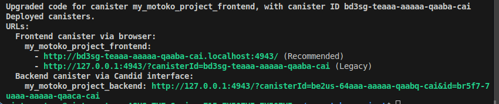

# 🧙‍♀️ Misty's ICP Dev Month Journey

Welcome to my Motoko project for the ICP Developer of the Month challenge! This repo tracks my daily progress as I learn, build, and cast spells in Motoko on the Internet Computer 🌐💫

---

## 🎯 What I'm Building

A Motoko-powered task manager that runs on the Internet Computer. Current features:

- ✅ Add tasks
- ✅ View all tasks
- ✅ Mark tasks complete
- 🗑️ Delete tasks (coming in Day 4)
- 💾 Persistent storage (coming soon!)

---

## 🧪 Progress Log

📅 View my daily dev journey in [`progress.md`](./progress.md)

---

## 🛠 How to Run Locally

```bash
dfx start --background
dfx deploy

Then you can run:

bash
Copy
Edit

Then you can run:

dfx canister call my_motoko_project_backend addTask '("Train in recursion dojo 🥋")'
dfx canister call my_motoko_project_backend getTasks
dfx canister call my_motoko_project_backend completeTask '(0)'

🌱 About Me
I'm Misty, a builder and explorer in the Web3 space, using Motoko to level up on the Internet Computer.
Let’s connect!
👾 GitHub: @rainwaters11

✨ Stay Tuned
More features, challenges, and UI updates coming soon...


---

## ✅ Step 3: Add & Commit Your README

```bash
git add README.md
git commit -m "Added README.md with project intro and usage guide"
git push

## 📸 Week 1 PART A Submission

Challenge: Advanced To-Do List  
Status: ✅ Completed  
Gist: [View Submission Gist](<paste gist link here>)  
Screenshot: 

### ✅ Features Implemented
- Task creation, completion, deletion
- Filtering (completed/incomplete/overdue)
- Bonus: Task editing & due date sorting

## 🔗 Week 1 PART B Gist Submission

## Project Name: We Care Empathy

### ✅ Achievements
- Integrated NFID & Internet Identity login (with dropdown)
- Verified principal identity via Rust backend (`whoami`)
- Used `@nfid/identitykit` + React + Tailwind
- Configured `dfx.json` and deployed Rust backend
- Hooked up frontend to call backend securely

### 🧪 How to Test
1. `dfx start --background`
2. `npm run build` in frontend
3. `dfx deploy`
4. Open frontend → test login with NFID or Internet Identity

### 🗂 Included Files
- `dfx.json`
- `backend.did`
- `frontend/src/AuthApp.jsx`

👉 [My GitHub Gist](https://gist.github.com/rainwaters11/5893d3b5797811780d6f4aecbbdc3f5b)

Week 2

## Live Demo


**How it works:**  
The Svelte front‑end talks to a Motoko canister to fetch your Bitcoin data:

```js
import { bitcoin_dapp } from 'declarations/bitcoin_dapp';

async function loadData() {
  const address = await bitcoin_dapp.getBitcoinAddress();
  const balance = await bitcoin_dapp.getBalance();
  console.log('Address:', address);
  console.log('Balance (sats):', balance);
}
